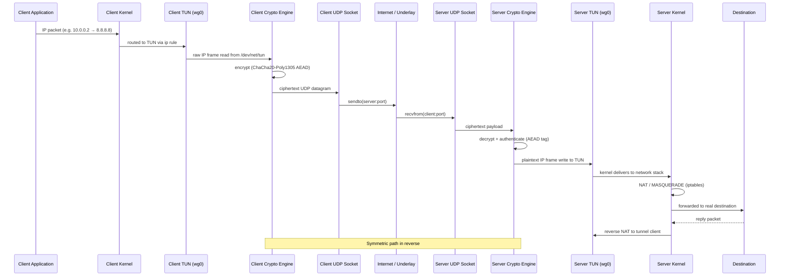

# GoTun

**A high-performance, encrypted Layer-3 tunnel in Go — WireGuard TUN + ChaCha20-Poly1305 over UDP.**

[](https://go.dev)
[](LICENSE)
[](https://www.kernel.org/)
[](https://github.com/synclabs-io/gotun)

---

GoTun is a lightweight, modular VPN tunnel that creates a virtual L3 network interface, encrypts
IP packets with authenticated AEAD encryption, and transports them over UDP datagrams. It is
designed for containerized environments and bare-metal Linux hosts that need a fast, auditable
tunnel without the overhead of a full VPN stack.

---

## Architecture

The following diagram shows the complete lifecycle of an IP packet traversing the tunnel:



**Text pipeline summary:**

```
Client App → Kernel → TUN (read) → Encrypt → UDP Send
                                              ↓
                                         Internet
                                              ↓
UDP Recv → Decrypt → TUN (write) → Kernel NAT → Destination
```

---

## Key Features

- **High-throughput batched I/O** — Uses WireGuard's official `golang.zx2c4.com/wireguard/tun`
  library for efficient I/O multiplexing on the TUN file descriptor.
- **Zero-allocation packet parsing** — The `pkg/packet` decoder reads IPv4 headers in-place with
  no heap allocations per packet.
- **AEAD authenticated encryption** — ChaCha20-Poly1305 provides confidentiality and integrity
  with a single symmetric operation per packet (no handshake overhead per datagram).
- **Dynamic multi-client routing** — The server maintains an in-memory routing table that maps
  virtual client IPs to their originating UDP endpoints, supporting N concurrent clients.
- **Clean modular architecture** — Strict separation of concerns: TUN adapter, crypto engine,
  transport layer, and router are isolated behind Go interfaces for independent testing and
  swapping.
- **Container-ready** — Ships with Docker and Kubernetes manifests pre-configured with
  `NET_ADMIN` capabilities and `/dev/net/tun` device access.

---

## Project Structure

```
gotun/
├── cmd/
│   ├── client/             # Client entry point — reads from TUN, encrypts, sends UDP
│   │   └── main.go
│   └── server/             # Server entry point — receives UDP, decrypts, writes to TUN
│       └── main.go
├── internal/
│   ├── crypto/             # ChaCha20-Poly1305 AEAD encrypt/decrypt wrapper
│   │   └── chacha.go
│   ├── router/             # In-memory virtual-IP → UDP-endpoint routing table
│   │   └── table.go
│   ├── transport/          # UDP socket read/write abstraction
│   │   └── udp.go
│   └── engine/             # Orchestration — wires TUN, crypto, transport, and router
│       └── tunnel.go
├── pkg/
│   └── packet/             # Zero-allocation IPv4 header parser (public API)
│       └── ipv4.go
├── deploy/
│   ├── Dockerfile          # Multi-stage build for minimal container image
│   └── k8s.yaml            # Kubernetes Deployment + DaemonSet manifest
├── go.mod
├── go.sum
└── LICENSE
```

| Layer | Responsibility |
|---|---|
| `cmd/` | CLI parsing, flag binding, and process lifecycle |
| `internal/engine` | Top-level orchestration — owns the main read/decrypt/forward loop |
| `internal/crypto` | Symmetric AEAD operations; keyed via shared secret |
| `internal/transport` | UDP datagram send/receive; endpoint abstraction |
| `internal/router` | Concurrent-safe map of virtual IP ↔ remote UDP address |
| `pkg/packet` | Stateless, allocation-free IPv4 header decoding (public, reusable) |

---

## Quickstart

### Prerequisites

| Requirement | Why |
|---|---|
| Linux kernel ≥ 5.4 | TUN device + modern netfilter |
| `CAP_NET_ADMIN` / root | Creating TUN interfaces, binding raw sockets, iptables rules |
| IP forwarding enabled | `sysctl -w net.ipv4.ip_forward=1` |
| Go ≥ 1.22 | Building from source |

### Build

```bash
# Clone
git clone https://github.com/synclabs-io/gotun.git && cd gotun

# Build both binaries
go build -o bin/gotun-server  ./cmd/server
go build -o bin/gotun-client  ./cmd/client
```

### Server Setup

```bash
# 1. Enable IP forwarding
sysctl -w net.ipv4.ip_forward=1

# 2. Start the tunnel server (listens on UDP :51820, assigns tunnel subnet 10.0.0.0/24)
sudo ./bin/gotun-server \
  --listen :51820 \
  --tun gotun0 \
  --tunnel-addr 10.0.0.1/24 \
  --secret <shared-secret-hex>

# 3. Configure NAT so tunnel clients reach the internet
iptables -t nat -A POSTROUTING -s 10.0.0.0/24 -o eth0 -j MASQUERADE
iptables -A FORWARD -i gotun0 -o eth0 -j ACCEPT
iptables -A FORWARD -i eth0 -o gotun0 -m state --state RELATED,ESTABLISHED -j ACCEPT
```

### Client Setup

```bash
# Start the client (connects to server, creates local TUN 10.0.0.2)
sudo ./bin/gotun-client \
  --server <server-ip>:51820 \
  --tun gotun0 \
  --tunnel-addr 10.0.0.2/24 \
  --secret <shared-secret-hex>

# Route traffic through the tunnel
ip route add 10.0.0.0/24 dev gotun0
ip route add 0.0.0.0/1 dev gotun0       # optional: tunnel all traffic
```

---

## Docker & Kubernetes

### Docker

```bash
docker build -t gotun-server -f deploy/Dockerfile .
docker run --rm --cap-add NET_ADMIN --device /dev/net/tun gotun-server \
  --listen :51820 --tun gotun0 --tunnel-addr 10.0.0.1/24 --secret <hex>
```

### Kubernetes

The minimal security context required for any pod running GoTun:

```yaml
apiVersion: apps/v1
kind: Deployment
metadata:
  name: gotun-server
spec:
  replicas: 1
  selector:
    matchLabels:
      app: gotun-server
  template:
    metadata:
      labels:
        app: gotun-server
    spec:
      containers:
        - name: gotun
          image: gotun-server:latest
          args:
            - "--listen"
            - ":51820"
            - "--tun"
            - "gotun0"
            - "--tunnel-addr"
            - "10.0.0.1/24"
            - "--secret"
            - "$(GOTUN_SECRET)"
          securityContext:
            capabilities:
              add: ["NET_ADMIN", "NET_RAW"]
          volumeMounts:
            - name: tun-device
              mountPath: /dev/net/tun
      volumes:
        - name: tun-device
          hostPath:
            path: /dev/net/tun
            type: CharDevice
```

---

## Roadmap

- [ ] Noise protocol handshake with ephemeral key exchange (X25519) and Perfect Forward Secrecy
- [ ] Cross-platform support via Wintun (Windows) and utun (macOS)
- [ ] Automatic route management via Netlink (no manual `ip route` / `iptables`)
- [ ] DNS leak prevention — built-in DNS capture and forwarding through the tunnel
- [ ] Prometheus metrics endpoint (throughput, packet counts, latency histograms)
- [ ] Graceful shutdown with connection draining
- [ ] Integration test suite with `gopacket` pcap validation

---

## License

MIT — see [LICENSE](LICENSE).
